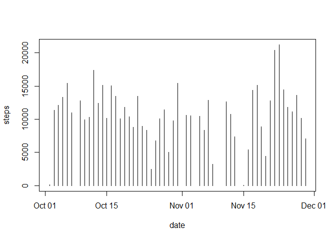
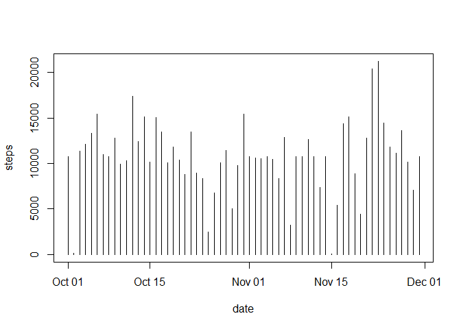
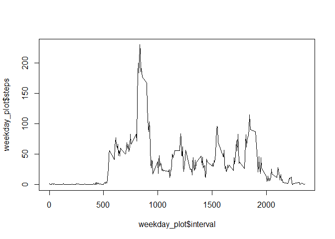
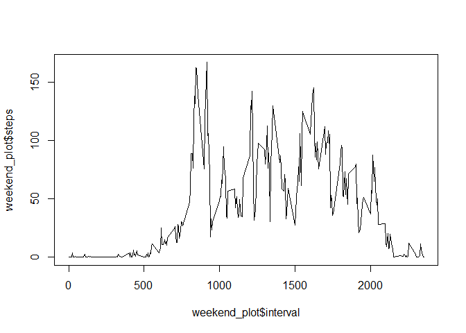

It is now possible to collect a large amount of data about personal movement using activity monitoring devices such as a Fitbit, Nike Fuelband, or Jawbone Up. These type of devices are part of the "quantified self" movement - a group of enthusiasts who take measurements about themselves regularly to improve their health, to find patterns in their behavior, or because they are tech geeks. But these data remain under-utilized both because the raw data are hard to obtain and there is a lack of statistical methods and software for processing and interpreting the data.

This project makes use of data from a personal activity monitoring device. This device collects data at 5 minute intervals through out the day. The data consists of two months of data from an anonymous individual collected during the months of October and November, 2012 and include the number of steps taken in 5 minute intervals each day.

The reports coming from this project include: mean total steps taken per day, average daily activity pattern, inputting of missing values, and the assessment of the difference in activity patterns between weekdays and weekends.

## Data

Dataset: Activity monitoring data [52K]

The variables included in this dataset are:

- steps: Number of steps taking in a 5-minute interval (missing values are coded as NA)

- date: The date on which the measurement was taken in YYYY-MM-DD format

- interval: Identifier for the 5-minute interval in which measurement was taken

The dataset is stored in a comma-separated-value (CSV) file and there are a total of 17,568 observations in this dataset.


## THE PROJECT BEGINS HERE: Loading and Processing Data

Read in the wearables activity data and process for the correct date format.


```r
data_activity <- read.csv("activity-monitoring.csv", header = T, na.strings = "NA")
data_activity$date <- as.Date(data_activity$date, format = "%Y-%m-%d")
```

Calculate the total steps taken in each day over the two month time period.


```r
total_daily_steps <- aggregate(steps~date, data_activity, sum)
```

Create a histogram of the daily steps data over the two month time period.


```r
plot(total_daily_steps, type="h")
```

<!-- -->

#Calculate the mean and median for the number of daily steps.


```r
mean_steps <- mean(total_daily_steps$steps, na.rm = TRUE)
mean_steps
```

```
## [1] 10766.19
```

```r
median_steps <- median(total_daily_steps$steps, na.rm = TRUE)
median_steps
```

```
## [1] 10765
```

Calculate the Average Daily Activity over the series of 5-minute intervals.


```r
interval_data <- aggregate(steps~interval, data_activity, mean)
```

Create a time-series plot of the 5-minute intervals


```r
ggplot(interval_data, aes(x = interval , y = steps)) + geom_line(color="blue", size=1) + labs(title = "Average Daily Steps", x = "Interval", y = "Average Steps per day")
```

<!-- -->

Locate and calculate the numbers for the time interval with the maximum (max) number of steps.


```r
interval_data[which.max(interval_data$steps),]
```

```
##     interval    steps
## 104      835 206.1698
```

#Inputting Missing Values

Determe the number of missing values in the data set.


```r
missing_values_steps <- sum(!complete.cases(data_activity$steps))
```

Devise a strategy for filling in the missing values and creating a new data frame.


```r
imp <- data_activity
  for (i in interval_data$interval) {
    imp[imp$interval == i & is.na(imp$steps), ]$steps <- 
      interval_data$steps[interval_data$interval == i]
  }
```

Create a histogram using the new data and the total daily steps taken.


```r
total_daily_steps_imp <- aggregate(steps~date, imp, sum)
plot(total_daily_steps_imp, type="h")
```

<!-- -->

Calculate a New Mean from the new data frame.


```r
mean_steps_imp <- mean(total_daily_steps_imp$steps, na.rm = TRUE)
mean_steps_imp
```

```
## [1] 10766.19
```

Calculate a New Median from the new data frame.


```r
median_steps_imp <- median(total_daily_steps_imp$steps, na.rm = TRUE)
median_steps_imp
```

```
## [1] 10766.19
```

#Determine the differences in activity patterns between weekdays and weekends

Create new factor variables for weekday and weekend


```r
data_week <- imp
data_week$weektime <- as.factor(ifelse(weekdays(data_week$date) %in% c("Saturday","Sunday"),"weekend", "weekday"))
head(data_week)
```

```
##       steps       date interval weektime
## 1 1.7169811 2012-10-01        0  weekday
## 2 0.3396226 2012-10-01        5  weekday
## 3 0.1320755 2012-10-01       10  weekday
## 4 0.1509434 2012-10-01       15  weekday
## 5 0.0754717 2012-10-01       20  weekday
## 6 2.0943396 2012-10-01       25  weekday
```

Create a time-series plot of the 5-minute intervals averaged across weekdays and weekends


```r
data_week <- imp 

data_week$weektime <- as.factor(ifelse(weekdays(data_week$date) %in% c("Saturday","Sunday"),"weekend", "weekday"))

Weekday_data <- subset(data_week, weektime=="weekday")
Weekend_data <- subset(data_week, weektime=="weekend")

weekday_plot <- aggregate(steps~interval, Weekday_data, mean)
weekend_plot  <- aggregate(steps~interval, Weekend_data, mean)

plot(weekday_plot$interval, weekday_plot$steps, type = "l")
```

<!-- -->

```r
plot(weekend_plot$interval, weekend_plot$steps, type = "l")
```

<!-- -->

