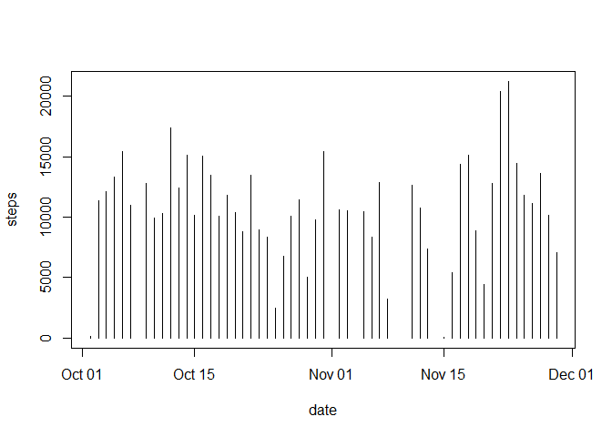
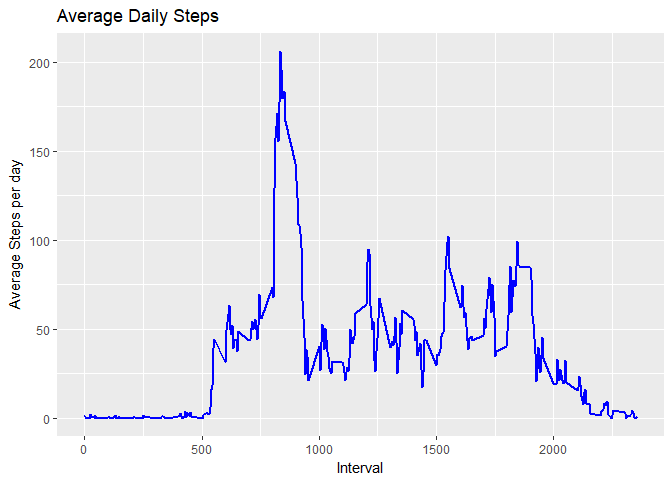
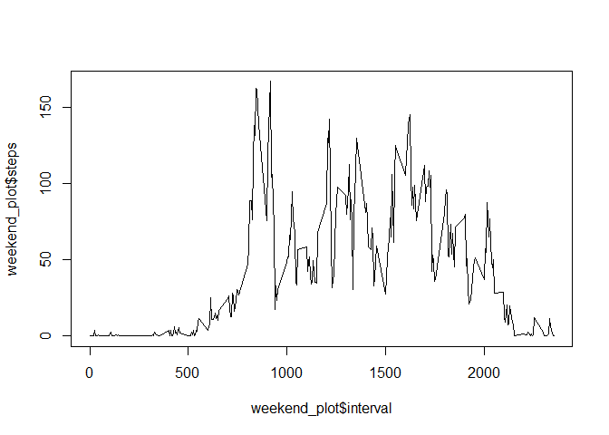

## Read in the wearables activity data


```r
data_activity <- read.csv("activity-monitoring.csv", header = T, na.strings = "NA")
data_activity$date <- as.Date(data_activity$date, format = "%Y-%m-%d")
```

## Calculate the steps in each day


```r
total_daily_steps <- aggregate(steps~date, data_activity, sum)
```

## Create a histogram of the daily steps data


```r
plot(total_daily_steps, type="h")
```

<!-- -->

#Calculate the mean and median for the number of daily steps


```r
mean_steps <- mean(total_daily_steps$steps, na.rm = TRUE)
median_steps <- median(total_daily_steps$steps, na.rm = TRUE)
```

#Calculate the Average Daily Activity
#Create a time-series plot of the 5-minute intervals


```r
interval_data <- aggregate(steps~interval, data_activity, mean)
plot(interval_data, type="l")
```

<!-- -->

```r
ggplot(interval_data, aes(x = interval , y = steps)) + geom_line(color="blue", size=1) + labs(title = "Average Daily Steps", x = "Interval", y = "Average Steps per day")
```

<!-- -->

#Calculate the Max steps for a particular interval


```r
interval_data[which.max(interval_data$steps),]
```

```
##     interval    steps
## 104      835 206.1698
```

#Inputting Missing Values

# Report on the number of missing values


```r
missing_values_steps <- sum(!complete.cases(data_activity$steps))
```

#Strategy for filling in the missing values and creating a new data frame


```r
imp <- data_activity
  for (i in interval_data$interval) {
    imp[imp$interval == i & is.na(imp$steps), ]$steps <- 
      interval_data$steps[interval_data$interval == i]
  }
```

#Create a histogram using the new data


```r
total_daily_steps_imp <- aggregate(steps~date, imp, sum)
plot(total_daily_steps_imp, type="h")
```

<!-- -->

#New Mean and New Median


```r
mean_steps_imp <- mean(total_daily_steps_imp$steps, na.rm = TRUE)
median_steps_imp <- median(total_daily_steps_imp$steps, na.rm = TRUE)
```

#Determining differences in activity patterns between weekdays and weekends

#Create new factor variable for weekday and weekend


```r
data_week <- imp
data_week$weektime <- as.factor(ifelse(weekdays(data_week$date) %in% c("Saturday","Sunday"),"weekend", "weekday"))
head(data_week)
```

```
##       steps       date interval weektime
## 1 1.7169811 2012-10-01        0  weekday
## 2 0.3396226 2012-10-01        5  weekday
## 3 0.1320755 2012-10-01       10  weekday
## 4 0.1509434 2012-10-01       15  weekday
## 5 0.0754717 2012-10-01       20  weekday
## 6 2.0943396 2012-10-01       25  weekday
```

#Create a time-series plot of the 5-minute intervals averaged across weekdays and weekends


```r
data_week <- imp 

data_week$weektime <- as.factor(ifelse(weekdays(data_week$date) %in% c("Saturday","Sunday"),"weekend", "weekday"))

Weekday_data <- subset(data_week, weektime=="weekday")
Weekend_data <- subset(data_week, weektime=="weekend")

weekday_plot <- aggregate(steps~interval, Weekday_data, mean)
weekend_plot  <- aggregate(steps~interval, Weekend_data, mean)

plot(weekday_plot$interval, weekday_plot$steps, type = "l")
```

<!-- -->

```r
plot(weekend_plot$interval, weekend_plot$steps, type = "l")
```

<!-- -->

